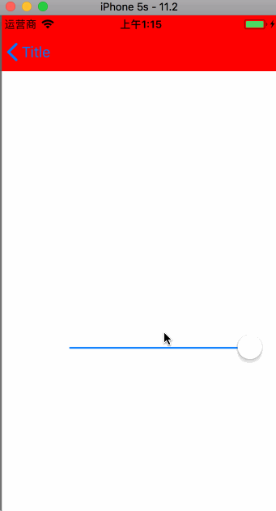
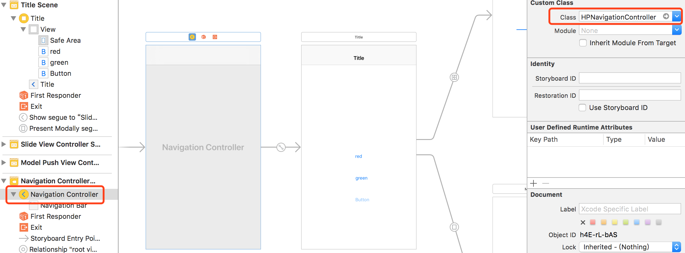
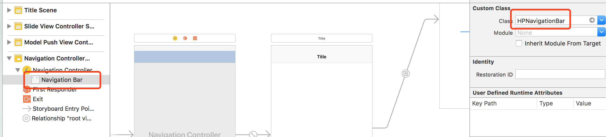

## HPNavigationBar


<p align="center" >
  
</p>

### 继承与HPNavgationController

<p align="center" >
  
</p>

### 继承与HPNavgationBar

<p align="center" >
  
</p>


### 在UIVIewController中使用 UIViewController+HPNavigation.h 中的扩展

```
self.hp_barBackgroundColor //修改Bar背景颜色

self.hp_barAlpha //修改Bar背景的透明度

self.hp_barEdgeLineAlpha //修改bar底部横线的透明度

self.hp_barEdgeLine //是否显示Bar底部的横线

self.hp_barHidden //是否展示Bar

self.hp_backInteraction //是否可以back 手势返回操作


```